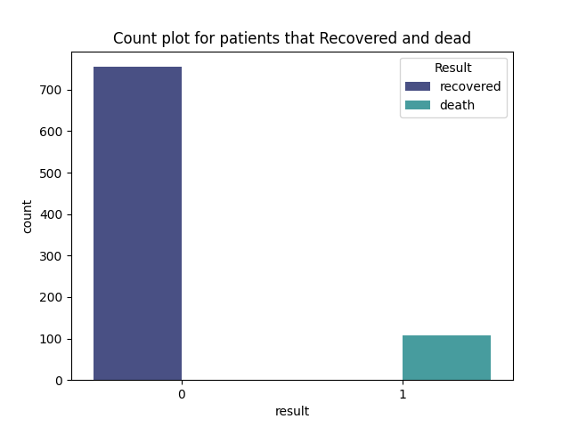
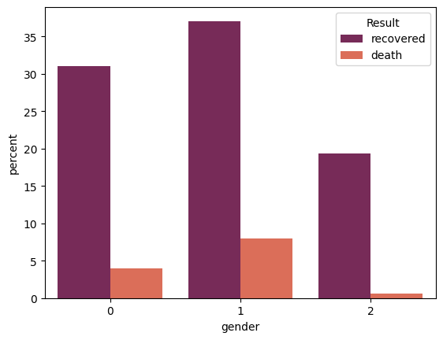
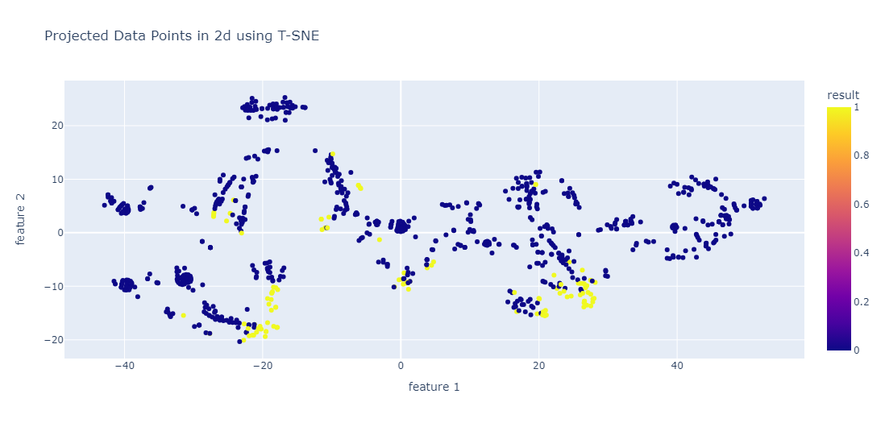
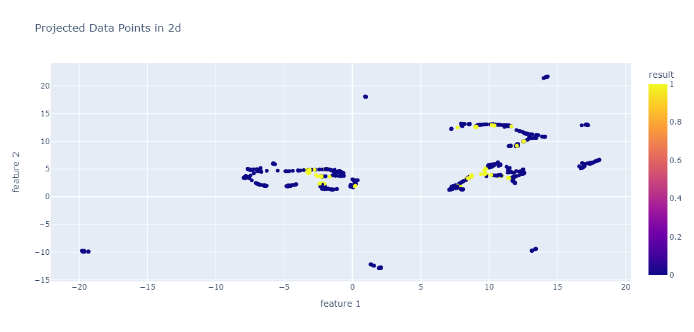

# COVID Outcome Prediction
## Analysis:
### Classes Distribution

As we can see the distribution of the classes is not balanced so we this give us indication of imbalancing problem should be resolved before modelling phase.
Methods that could be used are:
1. Customize the lose functions of models by giving a heigher weight to the lower class
2. using Sampling techniques such as Upsampling or DownSampling
3. using SMOTE which is not recommmanded in most cases due to the irrelavent data generated by it

### analysis based on gender:

Plot indicate the most affected people by the covid are the Women also they have the most recoverd percentage!

### Plot the Whole data:
#### Using T-SNE approach:

#### Using UMAP approach:

From the previous plots , we can notice that the data is not linearly seperable in the 2d dimension, may they are seperable in the heigher dimension, We can figure it out through out the analysis!

